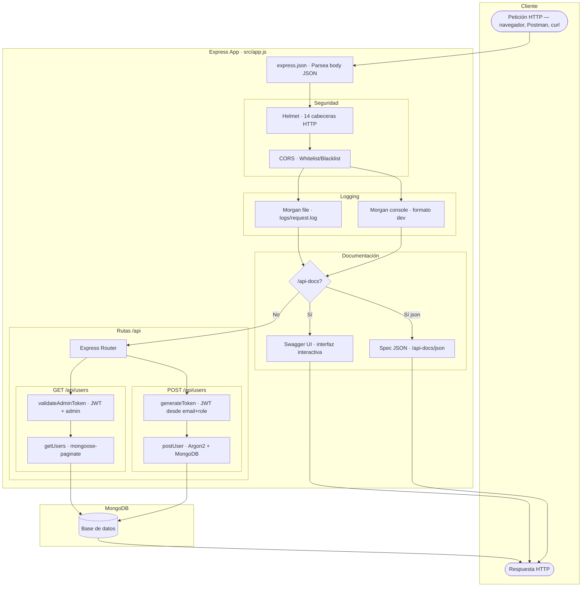
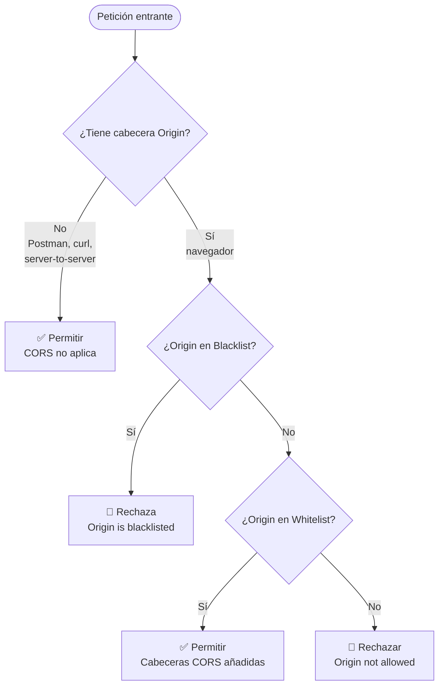

# Formacion Node.js, Express y MongoDB

> API RESTful desarrollada durante las clases dictadas a estudiantes de DAW.
> Utiizando Node.js, Express y MongoDB, con documentación interactiva Swagger, logging HTTP, cabeceras de seguridad y control de acceso CORS.

---

## Tecnologías

### En uso

| Tecnología | Uso |
|---|---|
| **Node.js** | Entorno de ejecución |
| **Express 5** | Framework HTTP |
| **MongoDB + Mongoose 9** | Base de datos y ODM |
| **mongoose-paginate-v2** | Paginación de consultas |
| **Argon2** | Hashing de contraseñas |
| **JSON Web Token (JWT)** | Autenticación basada en tokens |
| **Swagger (swagger-jsdoc + swagger-ui-express)** | Documentación interactiva OpenAPI 3.0 |
| **Helmet** | 14 cabeceras de seguridad HTTP |
| **Morgan** | Logging de peticiones HTTP (archivo + consola) |
| **CORS** | Control de acceso entre dominios (whitelist + blacklist) |
| **dotenv** | Variables de entorno |
| **Nodemon** | Recarga automática en desarrollo |
| **ESLint** | Linter para JavaScript |

### Pendientes de integración

Instaladas pero aún no activas en el código:

| Tecnología | Uso previsto |
|---|---|
| **express-rate-limit** | Limitación de peticiones |
| **DDoS** | Protección contra ataques DDoS |
| **Multer** | Subida de archivos |
| **mongoose-sequence** | Auto-incremento de campos |

### Planeadas

- OAuth2 o Passport.js para autenticación avanzada
- Pruebas de estrés (DDoS) con Artillery, JMeter o Locust (Python)

---

## Arquitectura

### Pipeline de middlewares (Request → Response)

El siguiente diagrama muestra el recorrido completo de una petición HTTP a través de todos los middlewares de Express, en el orden en que se ejecutan:



### Flujo CORS (whitelist + blacklist)



---

## Estructura del proyecto

```
├── .github/
│   └── workflows/
│       ├── lint.yml              # CI: Linter + notificación por email
│       └── upgrade_version.yml   # CI: Versionado semántico automático
├── src/
│   ├── app.js                    # Configuración de Express y middlewares
│   ├── server.js                 # Punto de entrada, conexión a BD y arranque
│   ├── config/                   # Configuraciones de runtime de la aplicación
│   │   ├── corsConfig.js         #   └─ Whitelist/blacklist de dominios
│   │   ├── helmetConfig.js       #   └─ 14 cabeceras de seguridad HTTP
│   │   ├── morganConfig.js       #   └─ Logger a archivo + consola
│   │   └── swaggerConfig.js      #   └─ Documentación OpenAPI 3.0
│   ├── controllers/              # Lógica de negocio
│   ├── database/                 # Conexión a MongoDB (fallback entre URIs)
│   ├── middlewares/              # Middlewares personalizados (JWT)
│   ├── models/                   # Esquemas de Mongoose
│   ├── routes/                   # Definición de rutas (con docs @openapi)
│   ├── utils/                    # Utilidades (regex, hash, etc.)
│   └── mocks/                    # Datos de prueba
├── logs/                         # Logs HTTP generados por Morgan (gitignored)
├── eslint.config.js              # Configuración de ESLint
├── Commit Guide.md               # Guía de Conventional Commits
└── package.json                  # Dependencias, scripts y aliases (#config/*, etc.)
```

---

## Instalación

1. **Clonar el repositorio**

   ```bash
   git clone https://github.com/didacusdev/Formacion_node_express.git
   cd Formacion_node_express
   ```

2. **Instalar dependencias**

   ```bash
   npm install
   ```

3. **Configurar variables de entorno**

   Copia el archivo de ejemplo y edítalo con tus datos:

   ```bash
   cp .example.env .env
   ```

   Contenido del `.env` a configurar:

   ```env
   PORT=3000
   JWT_SECRET=YourSecretKey
   DB_URL=mongodb+srv://<user>:<password>@<cluster>.mongodb.net/formacion_node_express
   DB_URL2=mongodb://<user>:<password>@<shard1>:27017,.../<db>?ssl=true&replicaSet=...&authSource=admin
   DB_URL_LOCAL=mongodb://localhost:27017/formacion_node_express
   ```

   > Configura al menos una de las URLs de base de datos (`DB_URL`, `DB_URL2` o `DB_URL_LOCAL`). La aplicación intentará conectarse en ese orden.

4. **Ejecutar el servidor**

   ```bash
   # Desarrollo (con recarga automática)
   npm run dev

   # Producción
   npm start
   ```

   El servidor estará disponible en `http://localhost:3000`.

---

## Documentación de la API (Swagger)

Una vez el servidor esté corriendo:

| Ruta | Descripción |
|---|---|
| [http://localhost:3000/api-docs](http://localhost:3000/api-docs) | Interfaz visual interactiva de Swagger UI |
| [http://localhost:3000/api-docs/json](http://localhost:3000/api-docs/json) | Especificación OpenAPI en JSON (para Postman, Insomnia, etc.) |

Desde Swagger UI puedes:
- Ver todos los endpoints, sus parámetros y respuestas posibles
- Probar endpoints directamente desde el navegador
- Autenticarte con JWT usando el botón **"Authorize" 🔒**

---

## Scripts disponibles

| Script | Comando | Descripción |
|---|---|---|
| `dev` | `npm run dev` | Arranca el servidor con Nodemon (recarga automática) |
| `start` | `npm start` | Arranca el servidor en modo producción |
| `lint` | `npm run lint` | Ejecuta ESLint y muestra errores |
| `lint:fix` | `npm run lint:fix` | Ejecuta ESLint y corrige errores automáticamente |

---

## CI/CD (GitHub Actions)

El proyecto cuenta con dos workflows de GitHub Actions que automatizan la calidad del código y el versionado.

### 1. Code Quality Check (`lint.yml`)

**Se ejecuta en:** Push y Pull Requests a `main` y `dev`.

| Paso | Descripción |
|---|---|
| Checkout del código | Clona el repositorio |
| Configurar Node.js 20 | Instala Node.js con caché de npm |
| Instalar dependencias | `npm ci` (instalación limpia) |
| Ejecutar Linter | Corre `npm run lint` y captura errores |
| Notificación por email | Envía email de éxito ✅ o error ❌ con detalles |
| Bloqueo de seguridad | Si el linter falla, **bloquea el merge de la PR** |

> [!IMPORTANT]
> Si el linter falla, la PR no puede ser mergeada. El workflow envía un email con los errores encontrados para que se corrijan antes del merge.

### 2. Upgrade Version (`upgrade_version.yml`)

**Se ejecuta en:** Pull Requests cerradas (merged) a cualquier rama.

| Paso | Descripción |
|---|---|
| Verificar checks | Confirma que todos los checks requeridos (linter) pasaron |
| Analizar título de PR | Lee el título de la PR siguiendo **Conventional Commits** |
| Determinar incremento | `feat:` → minor, `fix:`/`perf:` → patch, `feat!:` → major, `docs:`/`chore:` → none |
| Bump version | Actualiza `package.json` con `npm version` |
| Commit y push | Crea un commit automático `ci: bump version to vX.Y.Z [skip ci]` |
| Notificación por email | Envía email con la versión anterior, nueva y tipo de incremento |

> [!NOTE]
> El incremento de versión se basa **exclusivamente en el título de la PR**, no en los commits individuales. Consulta el archivo [Commit Guide.md](./Commit%20Guide.md) para la guía completa de Conventional Commits.

### Requisitos para los workflows

Los workflows necesitan los siguientes **secrets** y **variables** configurados en el repositorio de GitHub:

**Secrets (Settings → Secrets and variables → Actions → Secrets):**

| Secret | Uso |
|---|---|
| `ACTION_PAT` | Personal Access Token con permisos `contents: write` para que el bot pueda hacer push del bump de versión |
| `MAIL_USERNAME` | Email del remitente (para notificaciones) |
| `MAIL_PASSWORD` | Contraseña o App Password del email |
| `MAIL_TO` | Email destinatario de las notificaciones |

**Variables (Settings → Secrets and variables → Actions → Variables):**

| Variable | Uso |
|---|---|
| `MAIL_SERVER` | Servidor SMTP (ej: `smtp.gmail.com`) |
| `MAIL_PORT` | Puerto SMTP (ej: `587`) |

---

## Protección de ramas

> [!WARNING]
> La rama `main` está protegida. **No se permite hacer push directo a `main`** para ningún usuario. Todos los cambios deben realizarse a través de Pull Requests.

### Reglas de protección configuradas:

- **Push directo bloqueado:** Ningún colaborador puede hacer push a `main`, solo el propietario del repositorio.
- **PR requerida:** Todo cambio a `main` debe pasar por una Pull Request
- **Checks requeridos:** La PR debe pasar el workflow de linter (`Code Quality Check`) antes de poder ser mergeada
- **Flujo de trabajo recomendado:**
  1. Crear una rama desde `main` (ej: `feat/nueva-funcionalidad`)
  2. Hacer los cambios y commits siguiendo el [Commit Guide](./Commit%20Guide.md)
  3. Crear una Pull Request hacia `main`
  4. Esperar a que pase el linter ✅
  5. Merge de la PR → El bot incrementa la versión automáticamente

> [!TIP]
> - Si necesitas hacer cambios rápidos, puedes crear la rama, commitear y abrir la PR directamente. El linter se ejecuta automáticamente y si pasa, puedes mergear inmediatamente.
> - Cada PR debe cumplir con los estándares de `Conventional Commits` para que el workflow de versionado funcione correctamente.
>
> Para detalles consulta: [Commit Guide.md](./Commit%20Guide.md).

---

## Logging

Morgan genera logs HTTP en dos destinos simultáneamente:

| Destino | Formato | Ubicación |
|---|---|---|
| **Archivo** | `[timestamp] METHOD /path STATUS - IP - UserAgent` | `logs/request.log` |
| **Consola** | Formato `dev` (coloreado por status code) | Terminal donde corre el servidor |

Ejemplo de línea en `logs/request.log`:
```
[2024-05-10T12:30:45.123Z] GET /api/users 200 - 192.168.1.1 - PostmanRuntime/7.36.0
```

> El directorio `logs/` se crea automáticamente y está en `.gitignore`.

---

## Seguridad

### Helmet (cabeceras HTTP)

Helmet establece **14 cabeceras de seguridad** en cada respuesta. La configuración explícita de cada una está documentada en `src/config/helmetConfig.js`.

### CORS (control de acceso)

CORS está configurado con un sistema de **whitelist + blacklist**:
- **Whitelist:** `localhost` y `127.0.0.1` con puertos comunes (3000, 5173, 5500, 4200, 8080)
- **Blacklist:** Array vacío por defecto, listo para banear dominios/IPs
- La blacklist tiene **prioridad** sobre la whitelist

La configuración detallada está en `src/config/corsConfig.js`.

### Autenticación JWT

- **POST `/api/users`** genera un token JWT automáticamente al crear un usuario
- **GET `/api/users`** requiere un token JWT con rol `admin` en el header `Authorization: Bearer <token>`
- Las contraseñas se hashean con **Argon2id** antes de almacenarlas
