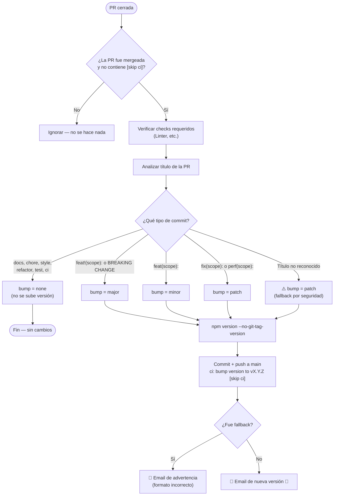
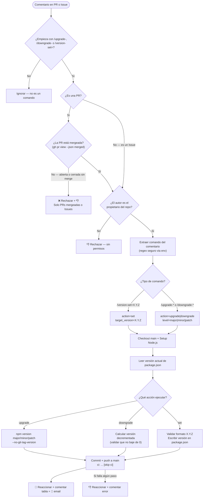
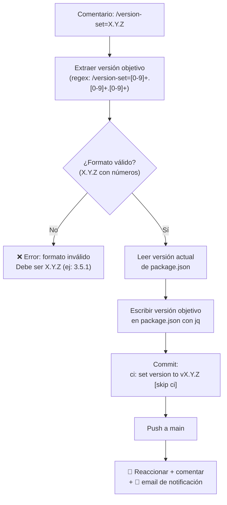
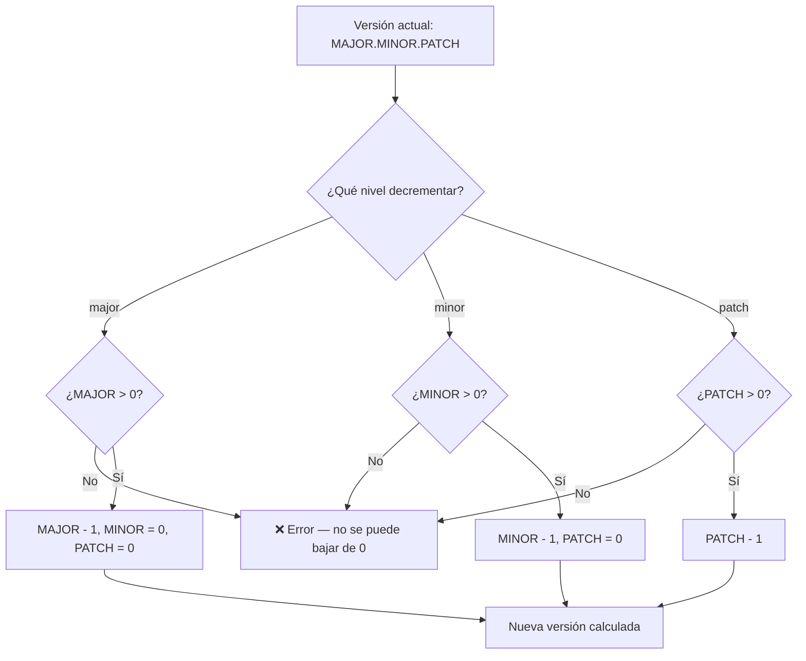
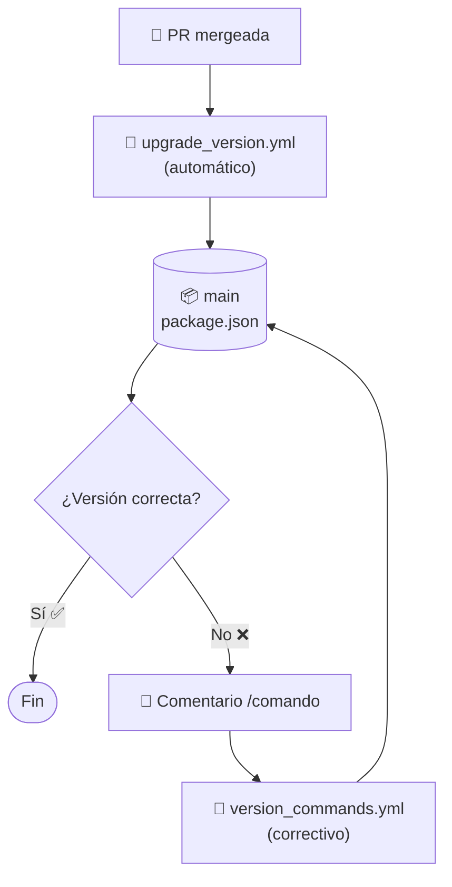

# Gestor de Versiones por Comandos

Este proyecto incluye un sistema de gestión de versiones manual mediante **comandos slash** (`/comando`) escritos en comentarios de **Pull Requests mergeadas** o **Issues** de GitHub. Los cambios **siempre se aplican sobre la rama `main`**.

> [!IMPORTANT]
> Este sistema es una **herramienta correctiva post-merge**, no un sustituto del versionado automático. El versionado principal se gestiona automáticamente al hacer merge de PRs mediante el workflow `Upgrade Version`, que lee el título de la PR siguiendo [Conventional Commits](./Commit%20Guide.md). Los comandos de este documento solo deben usarse **después del merge** cuando el versionado automático produce un resultado incorrecto o se necesita un ajuste manual justificado.

> [!WARNING]
> **Los comandos NO funcionan en PRs abiertas ni en PRs cerradas sin merge.** El workflow los rechazará automáticamente con un mensaje de error. Solo se pueden ejecutar en:
> - **PRs mergeadas** (cerradas con merge completado)
> - **Issues** (cualquier Issue del repositorio)
>
> Si necesitas que una PR suba versión, usa el título correcto según el [Commit Guide](./Commit%20Guide.md) y deja que el workflow automático lo gestione al mergear.

---

## Comandos disponibles

| Comando | Efecto | Ejemplo |
|---|---|---|
| `/upgrade-major` | Incrementa la versión MAJOR | `2.1.3` → `3.0.0` |
| `/upgrade-minor` | Incrementa la versión MINOR | `2.1.3` → `2.2.0` |
| `/upgrade-patch` | Incrementa la versión PATCH | `2.1.3` → `2.1.4` |
| `/downgrade-major` | Decrementa la versión MAJOR | `2.1.3` → `1.0.0` |
| `/downgrade-minor` | Decrementa la versión MINOR | `2.1.3` → `2.0.0` |
| `/downgrade-patch` | Decrementa la versión PATCH | `2.1.3` → `2.1.2` |
| `/version-set=X.Y.Z` | Establece una versión exacta | `/version-set=3.5.1` |

> [!NOTE]
> Los comandos de downgrade no pueden reducir ningún componente por debajo de `0`. Si se intenta, el workflow fallará con un mensaje de error.

---

## ¿Quién puede ejecutarlos?

> [!WARNING]
> **Solo el propietario del repositorio** puede ejecutar estos comandos. Si otro usuario intenta usarlos, el workflow reaccionará con 👎 y terminará sin hacer cambios. Esto previene cambios de versión no autorizados.

---

## ¿Dónde se ejecutan?

Los comandos se pueden escribir como comentario en:

- **Pull Requests mergeadas** (la PR debe haber sido cerrada con merge completado)
- **Issues** (cualquier Issue del repositorio)

> [!NOTE]
> Si se intenta ejecutar un comando en una **PR abierta** o en una **PR cerrada sin merge**, el workflow lo rechazará automáticamente con un mensaje de error: *"Los comandos de versión solo se pueden ejecutar en PRs mergeadas o en Issues."*

El cambio **siempre se aplica sobre la rama `main`**, independientemente de dónde se escriba el comentario.

---

## ¿Cómo usarlos?

1. Ir a una **PR mergeada** o a cualquier **Issue** del repositorio en GitHub
2. Escribir el comando en el campo de comentario (una línea, sin texto adicional necesario)
3. Hacer clic en **"Comment"**
4. Esperar la reacción del bot:
   - 🚀 = Éxito (se añade un comentario con los detalles del cambio)
   - 👎 = Error (se añade un comentario indicando el problema)

Ejemplo:
```
/version-set=2.0.0
```

---

## Cuándo usar cada comando

### Casos válidos de uso

| Situación | Comando recomendado |
|---|---|
| El workflow automático aplicó `patch` por fallback (título de PR incorrecto) y no debía subir versión | `/downgrade-patch` |
| Se mergeó una PR como `feat:` pero en realidad era un `fix:` (minor en vez de patch) | `/downgrade-minor` seguido de `/upgrade-patch` o directamente `/version-set=X.Y.Z` |
| Se necesita forzar un salto de versión major por decisión del equipo | `/upgrade-major` |
| Se quiere alinear la versión del proyecto con una versión externa o release planificado | `/version-set=X.Y.Z` |
| Se detectó que la versión actual es incorrecta tras varios merges | `/version-set=X.Y.Z` (establecer la versión correcta directamente) |

### Cuándo NO usarlos

> [!WARNING]
> Evita usar estos comandos sin justificación. El versionado debe ser automático y predecible. Casos donde **NO** deberías usarlos:
>
> - **Para subir versión de una PR normal** → Usa el título correcto de la PR y deja que el workflow automático lo haga
> - **Para "probar" si funciona** → Cada ejecución modifica `main` con un commit real
> - **Para saltar versiones arbitrariamente** → Las versiones deben reflejar el historial real de cambios
> - **Sin comunicar al equipo** → Cualquier cambio manual de versión debe ser comunicado y justificado

---

## Ejemplos prácticos

### Ejemplo en una PR mergeada

**Escenario:** Se mergeó la PR `#42` con título `actualizar dependencias` (sin formato Conventional Commits). El workflow automático aplicó `patch` por fallback, subiendo de `v1.3.0` a `v1.3.1`. Pero era solo una tarea de mantenimiento que no debía subir versión.

**Corrección:** Ir a la PR `#42` (ya mergeada) y escribir un comentario:

```
/downgrade-patch
```

**Resultado:** El bot reacciona con 🚀 y responde:

| | |
|---|---|
| **Comando** | `/downgrade-patch` |
| **Anterior** | `v1.3.1` |
| **Nueva** | `v1.3.0` |
| **Ejecutado por** | @propietario |

---

**Escenario:** Se mergeó la PR `#58` con título `feat(auth): añadir login con OAuth`. El workflow automático subió la versión de `v2.0.0` a `v2.1.0` (minor). Pero el equipo decidió que esta funcionalidad representa un **cambio mayor** porque rompe la API anterior de autenticación.

**Corrección:** Ir a la PR `#58` (ya mergeada) y escribir un comentario:

```
/version-set=3.0.0
```

**Resultado:** El bot reacciona con 🚀 y responde:

| | |
|---|---|
| **Comando** | `/set-manual` |
| **Anterior** | `v2.1.0` |
| **Nueva** | `v3.0.0` |
| **Ejecutado por** | @propietario |

---

### Ejemplo en un Issue

**Escenario:** Tras varios merges, el equipo detecta que la versión actual `v3.2.7` no es correcta: debería ser `v3.3.0` porque uno de los merges anteriores era una `feat:` que fue titulada incorrectamente como `fix:`.

**Corrección:** Crear un Issue (o usar uno existente) y escribir un comentario:

```
/version-set=3.3.0
```

**Resultado:** El bot reacciona con 🚀 y responde:

| | |
|---|---|
| **Comando** | `/set-manual` |
| **Anterior** | `v3.2.7` |
| **Nueva** | `v3.3.0` |
| **Ejecutado por** | @propietario |

---

**Escenario:** El equipo quiere preparar un release major antes de un despliegue importante. La versión actual es `v4.8.2` y quieren alinear con `v5.0.0`.

**Corrección:** Ir a cualquier Issue del repositorio y escribir:

```
/upgrade-major
```

**Resultado:**

| | |
|---|---|
| **Comando** | `/upgrade-major` |
| **Anterior** | `v4.8.2` |
| **Nueva** | `v5.0.0` |
| **Ejecutado por** | @propietario |

> [!TIP]
> Usar Issues es útil cuando la corrección no está asociada a una PR específica, sino a una decisión general del equipo o a un error acumulado de varias PRs.

---

## Cómo funciona internamente

### Workflow `upgrade_version.yml` — Versionado automático

Este workflow se ejecuta automáticamente cada vez que una PR se mergea en `main`. Analiza el título de la PR siguiendo el estándar [Conventional Commits](./Commit%20Guide.md) y determina el tipo de incremento.



### Workflow `version_commands.yml` — Comandos manuales

Este workflow se dispara cuando se escribe un comentario en una PR o Issue. Soporta tres tipos de acciones: `/upgrade-*`, `/downgrade-*` y `/version-set=X.Y.Z`.



### Flujo de `/version-set=X.Y.Z` (detalle)



### Flujo de downgrade (detalle)



### Relación entre ambos workflows

| | 🔄 **Versionado automático** | 🔧 **Versionado manual (correctivo)** |
|---|---|---|
| **Workflow** | `upgrade_version.yml` | `version_commands.yml` |
| **Se dispara con** | Merge de una PR (`pull_request: closed`) | Comentario `/comando` (`issue_comment: created`) |
| **Entrada** | Título de la PR (Conventional Commits) | Comando slash del comentario |
| **Acciones** | Incrementa versión: `major` / `minor` / `patch` / `none` | Corrige versión: `upgrade` / `downgrade` / `set` |
| **Destino** | `main` → `package.json` | `main` → `package.json` |
| **Momento** | Automático, inmediato tras el merge | Manual, cuando se detecta un error post-merge |
| **Relación** | Se ejecuta **primero** | Corrige **después** si fue necesario |



> [!NOTE]
> Ambos workflows operan sobre `main` pero **no se ejecutan simultáneamente**:
> - `upgrade_version.yml` se dispara al hacer merge (evento `pull_request: closed`)
> - `version_commands.yml` se dispara al escribir un comentario (evento `issue_comment: created`)
> - Los commits generados por ambos usan `[skip ci]` para no disparar workflows en cadena

---

## Feedback del bot

### Éxito

Cuando un comando se ejecuta correctamente, el bot:

1. Reacciona al comentario con 🚀
2. Responde con una tabla:

| | |
|---|---|
| **Comando** | `/upgrade-minor` |
| **Anterior** | `v2.1.3` |
| **Nueva** | `v2.2.0` |
| **Ejecutado por** | @propietario |

### Error

Cuando un comando falla, el bot:

1. Reacciona al comentario con 👎
2. Responde indicando el error y un enlace a los logs del workflow

---

## Requisitos técnicos

El workflow necesita el secret `ACTION_PAT` configurado en el repositorio (Settings → Secrets → Actions). Este es un Personal Access Token con permisos `contents: write` que permite al bot hacer push a `main`.

> [!TIP]
> Este es el mismo secret que usa el workflow `Upgrade Version`. Si ya está configurado, no necesitas hacer nada adicional.